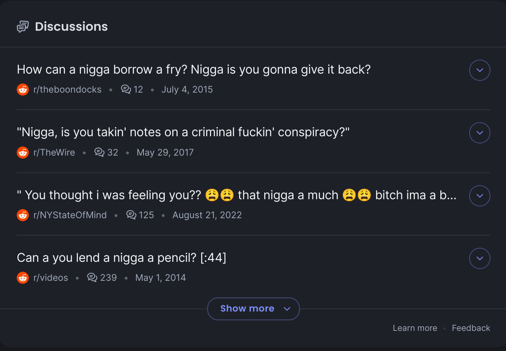
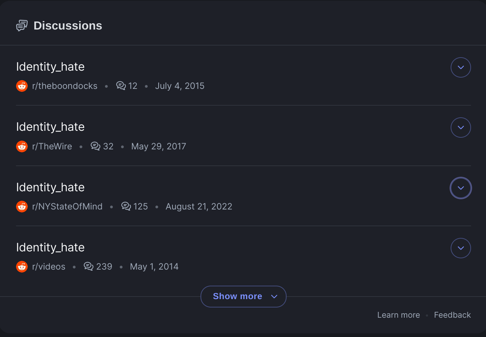

# Obscenity filter

This is a chrome extension that uses AI to filter out textual content on the internet that you do not wish to be exposed to.

This extension currently must be installed manually, by downloading the CRX file in the latest release. Additionally, you will need to run `python api.py` on a computer to run the backend. This can be done on the computer that is running the extension (put "localhost:5000" as the server if you do this).

## Motivation

On the internet, we often do not have a choice about what text content we are exposed to, as the only way to know that we would like to not read certain content is to read it to make that distinction. The alternative is to moderate the internet to remove all content that people may not like to see. However, this is undersirable because different people have different types of speech they are comfortable with, and extreme moderation punishes everyone for the sake of a minority.

Instead, this extension was created to place content moderation in the hands of each individual user, to choose whether or not you would like to see certain types content on the internet. This system allows us to control what we see on the internet without trampling on anyone's right to free speech, a crucial aspect of the internet.

# What it does

This extension reads every snippet of text that is loaded on your screen and removes obscene text, replacing it with a descriptor of why the text was blocked.

See an example below:

**Before:**

**After:**
